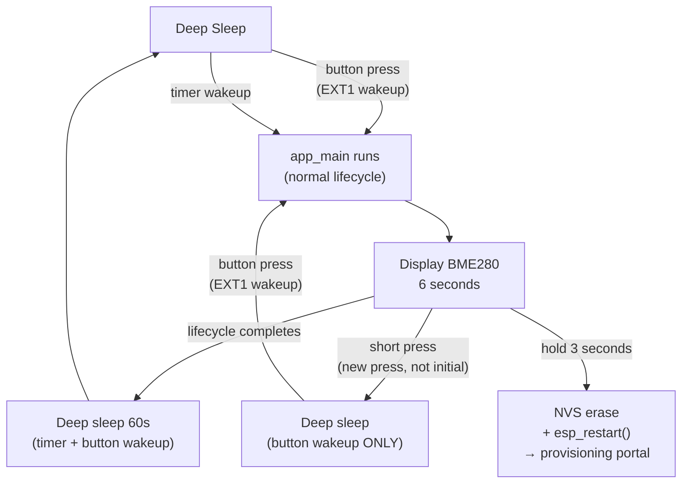

# Button Component for temp_cube_v2

## Architecture

Three behaviors are triggered off a single GPIO0 active-low button:



**Key design decisions:**
- ESP32-S3 does not support EXT0 wakeup; use `esp_sleep_enable_ext1_wakeup(1ULL << GPIO_NUM_0, ESP_EXT1_WAKEUP_ANY_LOW)`
- Initial press guard: if the button woke the device (GPIO already LOW when task starts), that press/release is ignored to prevent immediately going back to sleep
- Long press is allowed from the initial press (intentional 3s hold right after wake triggers provisioning reset)
- Normal 60s sleep also enables EXT1 so the button can wake the device early

## New Files

### `components/button/button.c`

Core logic — polling task at 20ms intervals, active-low, tracks `initial_press` flag:

```c
static void button_task(void *arg)
{
    bool pressed       = (gpio_get_level(BUTTON_GPIO) == 0);
    bool initial_press = pressed;  // ignore first release if button woke us
    bool long_triggered = false;
    int64_t press_start_ms = pressed ? esp_timer_get_time() / 1000 : 0;

    while (true) {
        vTaskDelay(pdMS_TO_TICKS(POLL_MS));
        int level = gpio_get_level(BUTTON_GPIO);

        if (level == 0 && !pressed) {
            pressed = true; initial_press = false;
            long_triggered = false;
            press_start_ms = esp_timer_get_time() / 1000;

        } else if (level == 1 && pressed) {
            bool was_initial = initial_press;
            pressed = false; initial_press = false;
            if (!long_triggered && !was_initial) {
                // Short press while awake → button-only sleep
                esp_sleep_enable_ext1_wakeup(1ULL << BUTTON_GPIO, ESP_EXT1_WAKEUP_ANY_LOW);
                esp_deep_sleep_start();
            }

        } else if (level == 0 && pressed && !long_triggered) {
            int64_t held = (esp_timer_get_time() / 1000) - press_start_ms;
            if (held >= LONG_PRESS_MS) {
                long_triggered = true;
                nvs_flash_init(); nvs_flash_erase(); esp_restart();
            }
        }
    }
}
```

Public API adds `button_enable_wakeup_source()` so `main.c` can call it before its own sleep without knowing the GPIO number:

```c
void button_enable_wakeup_source(void) {
    esp_sleep_enable_ext1_wakeup(1ULL << BUTTON_GPIO, ESP_EXT1_WAKEUP_ANY_LOW);
}
```

### `components/button/include/button.h`

```c
void button_init(void);
void button_enable_wakeup_source(void);  // call before esp_deep_sleep_start()
```

### `components/button/CMakeLists.txt`

```cmake
idf_component_register(SRCS "button.c"
                        INCLUDE_DIRS "include"
                        REQUIRES esp_driver_gpio nvs_flash esp_timer)
```

### `components/button/Kconfig.projbuild`

Mirrors reference component — `CONFIG_BUTTON_GPIO` (default 0), `CONFIG_BUTTON_LONG_PRESS_SEC` (default 3, range 1–10). Both are actually consumed by the code (no Kconfig gap like the reference).

## Modified Files

### [`main/main.c`](c:\Users\ervin\source\repos\Personal\temp_cube_v2\main\main.c)

Two changes:

1. Add `#include "button.h"` and call `button_init()` at the top of `app_main`, before `wifi_manager_init()`.

2. In the normal sleep path (lines 105–107), also enable button wakeup:

```c
ESP_LOGI(APP_TAG, "Entering deep sleep for 60 seconds");
button_enable_wakeup_source();
ESP_ERROR_CHECK(esp_sleep_enable_timer_wakeup(DEEP_SLEEP_TIME_US));
esp_deep_sleep_start();
```

### [`main/CMakeLists.txt`](c:\Users\ervin\source\repos\Personal\temp_cube_v2\main\CMakeLists.txt)

Add `button` to `REQUIRES`:

```cmake
idf_component_register(SRCS "main.c"
                    INCLUDE_DIRS "."
                    REQUIRES ssd1306 esp_driver_i2c temp_cube_bme280 wifi-manager button)
```

## Behavior Summary

| Scenario | What happens |
|---|---|
| Device in any deep sleep, button pressed | EXT1 wakeup fires, `app_main` runs full lifecycle |
| Device awake, short press + release | Enters deep sleep with EXT1 only (no timer); wakes only on next button press |
| Device awake, hold 3s | NVS erased, device restarts, provisioning portal opens |
| Button is already held when task starts (woke device) | Release is silently ignored; device continues normal lifecycle |
