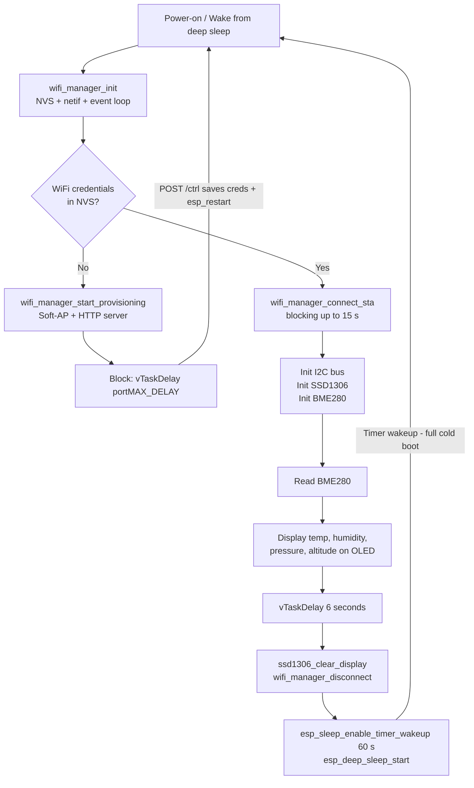

# Deep Sleep Measurement Cycle

## Flow



**Key deep-sleep facts for ESP32-S3:** deep sleep is a full cold boot — all RAM is cleared, all peripherals reset. `app_main` runs from scratch on every wake. No distinction between first boot and timer wake is needed once credentials exist.

---

## Files Changed

### 1. [`components/wifi-manager/include/wifi-manager.h`](components/wifi-manager/include/wifi-manager.h)

Add three new public functions; remove the implicit "start WiFi" behavior from `wifi_manager_init`:

```c
// Simplified: NVS + netif + event loop only (no WiFi start)
void wifi_manager_init(void);

// New
void wifi_manager_start_provisioning(void);            // starts soft-AP + HTTP server
esp_err_t wifi_manager_connect_sta(uint32_t timeout_ms); // blocking STA connect
void wifi_manager_disconnect(void);                    // stop + deinit WiFi for sleep
```

### 2. [`components/wifi-manager/wifi-manager.c`](components/wifi-manager/wifi-manager.c)

- **`wifi_manager_init()`** — keep only NVS flash init, `esp_netif_init()`, `esp_event_loop_create_default()`. Remove the mode-check and WiFi start logic.
- **`wifi_manager_start_provisioning()`** — calls existing `start_soft_ap()`.
- **`wifi_manager_connect_sta(timeout_ms)`** — reads stored SSID/pass, creates STA netif, inits WiFi, registers event handlers, starts, then blocks on a `FreeRTOS EventGroup` until `IP_EVENT_STA_GOT_IP` fires or timeout elapses. Returns `ESP_OK` or `ESP_ERR_TIMEOUT`.
- **`wifi_manager_disconnect()`** — deregisters event handlers, calls `esp_wifi_stop()` + `esp_wifi_deinit()` + `esp_netif_destroy_default_wifi(sta_netif)`.
- Remove `wifi_init_sta()` and the old `get_wifi_mode` / `set_wifi_mode` / mode-branching logic from `wifi_manager_init` (those helpers can stay but are no longer called at init time).

### 3. [`main/main.c`](main/main.c)

Replace the infinite `while(true)` loop with a linear measurement cycle:

```c
void app_main(void)
{
    wifi_manager_init();   // NVS + netif + event loop

    char ssid[33], pass[65];
    if (!wifi_manager_get_credentials(ssid, sizeof(ssid), pass, sizeof(pass))) {
        // No credentials stored — run provisioning until esp_restart()
        wifi_manager_start_provisioning();
        vTaskDelay(portMAX_DELAY);
        return;
    }

    // Measurement cycle (runs on every boot / wake)
    if (wifi_manager_connect_sta(15000) != ESP_OK) {
        ESP_LOGW(TAG, "WiFi connect timed out");
    }

    // Init I2C → SSD1306 → BME280 (same as before)
    // Read BME280, display 4 lines
    // vTaskDelay 6000 ms
    // ssd1306_clear_display + wifi_manager_disconnect

    esp_sleep_enable_timer_wakeup(60ULL * 1000 * 1000);  // 60 s
    esp_deep_sleep_start();
}
```

---

## Notes

- `http-server.c` already calls `esp_restart()` (line 242) after saving credentials — no change needed there.
- `get_wifi_mode` / `set_wifi_mode` / `wifi_manager_erase_credentials` can stay as utility functions but are no longer part of the boot path.
- The 6-second display window and 60-second sleep duration will be defined as named constants in `main.c`.
- On WiFi connect timeout, the device still goes to deep sleep (graceful degradation — avoids hanging forever on a dead AP).
