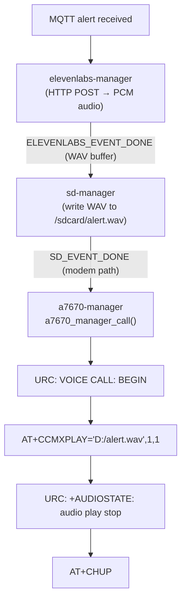

# ElevenLabs TTS → SD Card → AT+CCMXPLAY

## Architecture



## Assumptions

- The SD card is shared: ESP32 mounts it via SDMMC (1-bit, CLK=GPIO12, CMD=GPIO11, D0=GPIO13 per the reference sketch) at `/sdcard`; the A7670 modem accesses the same physical card at `D:/`.
- ElevenLabs `output_format: "pcm_16000"` (raw 16kHz 16-bit mono PCM) is requested; the component wraps it in a standard WAV header before writing to disk.

---

## New Component: `components/elevenlabs-manager/`

**Files:** `elevenlabs-manager.c`, `include/elevenlabs-manager.h`, `CMakeLists.txt`, `Kconfig.projbuild`

**Kconfig settings:**
- `ELEVENLABS_API_KEY` (string)
- `ELEVENLABS_VOICE_ID` (string, default `"21m00Tcm4TlvDq8ikWAM"` — Rachel)
- `ELEVENLABS_MODEL_ID` (string, default `"eleven_turbo_v2_5"`)

**Public API:**
```c
ESP_EVENT_DECLARE_BASE(ELEVENLABS_MANAGER_EVENT);
typedef enum { ELEVENLABS_MANAGER_EVENT_DONE, ELEVENLABS_MANAGER_EVENT_ERROR } elevenlabs_manager_event_t;
typedef struct { uint8_t *data; size_t len; } elevenlabs_manager_audio_t;

esp_err_t elevenlabs_manager_tts(const char *text);
```

**Implementation notes:**
- Spawns a FreeRTOS task; uses `esp_http_client` with `HTTP_METHOD_POST`
- URL: `https://api.elevenlabs.io/v1/text-to-speech/<voice_id>`
- Headers: `xi-api-key`, `Content-Type: application/json`, `Accept: audio/pcm;rate=16000`
- Body: `{"text":"...","model_id":"...","output_format":"pcm_16000"}`
- Accumulates response into a heap buffer
- Prepends a 44-byte WAV header (16kHz, 16-bit, 1ch, PCM) before posting the event
- Posts `ELEVENLABS_MANAGER_EVENT_DONE` with `elevenlabs_manager_audio_t`; caller must `free(data)`
- `CMakeLists.txt` requires `esp_http_client`, `esp_event`, `freertos`

---

## New Component: `components/sd-manager/`

**Files:** `sd-manager.c`, `include/sd-manager.h`, `CMakeLists.txt`, `Kconfig.projbuild`

**Kconfig settings:**
- `SD_MOUNT_POINT` (string, default `"/sdcard"`)
- `SD_ALERT_FILENAME` (string, default `"alert.wav"`)
- `SD_CLK_PIN` (int, default `12`)
- `SD_CMD_PIN` (int, default `11`)
- `SD_D0_PIN` (int, default `13`)

**Public API:**
```c
ESP_EVENT_DECLARE_BASE(SD_MANAGER_EVENT);
typedef enum { SD_MANAGER_EVENT_READY, SD_MANAGER_EVENT_WRITE_DONE, SD_MANAGER_EVENT_ERROR } sd_manager_event_t;
typedef struct { char modem_path[64]; } sd_manager_write_done_t;

esp_err_t sd_manager_init(void);
esp_err_t sd_manager_write_wav(const uint8_t *data, size_t len);
```

**Implementation notes:**
- `sd_manager_init()`: configures SDMMC host (1-bit), calls `esp_vfs_fat_sdmmc_mount`, posts `SD_MANAGER_EVENT_READY`
- `sd_manager_write_wav()`: opens `<mount_point>/<filename>`, writes buffer, closes, posts `SD_MANAGER_EVENT_WRITE_DONE` with `modem_path = "D:/alert.wav"`
- `CMakeLists.txt` requires `fatfs`, `sdmmc`, `esp_event`

---

## Modified `components/a7670-manager/`

Changes to [`a7670-manager.c`](components/a7670-manager/a7670-manager.c) and [`a7670-manager.h`](components/a7670-manager/include/a7670-manager.h):

- Replace `s_tts_message` / `s_tts_pending` with `s_audio_file_path[128]` / `s_audio_pending`
- New public function:
  ```c
  esp_err_t a7670_manager_call_with_file(const char *modem_file_path);
  ```
  Stores the modem path, removes `AT+CDTAM=1`, dials with `ATD<number>;`
- In `rx_reader_task`, on `VOICE CALL: BEGIN`: send `AT+CCMXPLAY="<path>",1,1` instead of `AT+CTTS`
- On `+AUDIOSTATE: audio play stop`: send `AT+CHUP` (replaces `+CTTS: 0` trigger)
- Retain existing `a7670_manager_call()` as a TTS fallback (keep `AT+CTTS` path intact) so `main.c` can choose

---

## Updated `main/main.c`

New event flow:

```c
// on_mqtt_alert → start ElevenLabs TTS
static void on_mqtt_alert(void *arg, ...) {
    elevenlabs_manager_tts(alert->data);
}

// on_elevenlabs_done → write to SD
static void on_elevenlabs_done(void *arg, ...) {
    elevenlabs_manager_audio_t *audio = data;
    sd_manager_write_wav(audio->data, audio->len);
    free(audio->data);
}

// on_sd_write_done → place call with file
static void on_sd_write_done(void *arg, ...) {
    sd_manager_write_done_t *result = data;
    a7670_manager_call_with_file(result->modem_path);
}
```

Register three additional event handlers in `app_main`. Also call `sd_manager_init()` in `app_main`.

---

## Build System Changes

- Root [`CMakeLists.txt`](CMakeLists.txt): no changes needed (IDF auto-discovers `components/`)
- [`main/CMakeLists.txt`](main/CMakeLists.txt): add `elevenlabs-manager sd-manager` to `REQUIRES`
- New `components/mqtt-manager/idf_component.yml`-style deps: `esp_http_client` is part of ESP-IDF core, no extra manifest entry needed

---

## File Summary

| Action | Path |
|--------|------|
| Create | `components/elevenlabs-manager/elevenlabs-manager.c` |
| Create | `components/elevenlabs-manager/include/elevenlabs-manager.h` |
| Create | `components/elevenlabs-manager/CMakeLists.txt` |
| Create | `components/elevenlabs-manager/Kconfig.projbuild` |
| Create | `components/sd-manager/sd-manager.c` |
| Create | `components/sd-manager/include/sd-manager.h` |
| Create | `components/sd-manager/CMakeLists.txt` |
| Create | `components/sd-manager/Kconfig.projbuild` |
| Modify | `components/a7670-manager/a7670-manager.c` |
| Modify | `components/a7670-manager/include/a7670-manager.h` |
| Modify | `main/main.c` |
| Modify | `main/CMakeLists.txt` |
